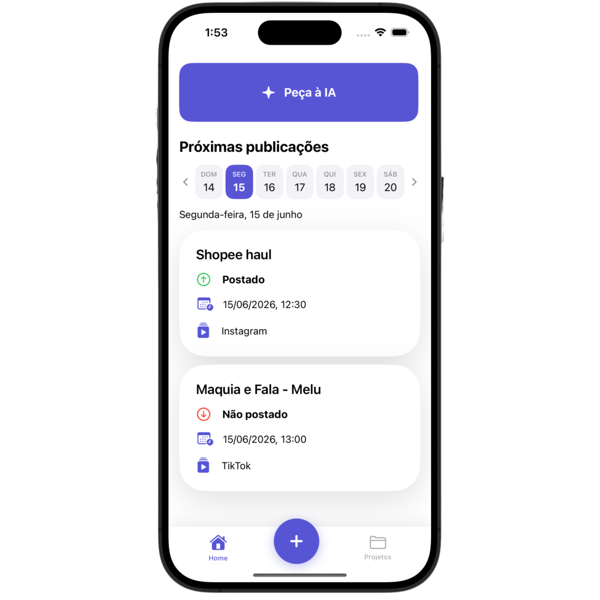
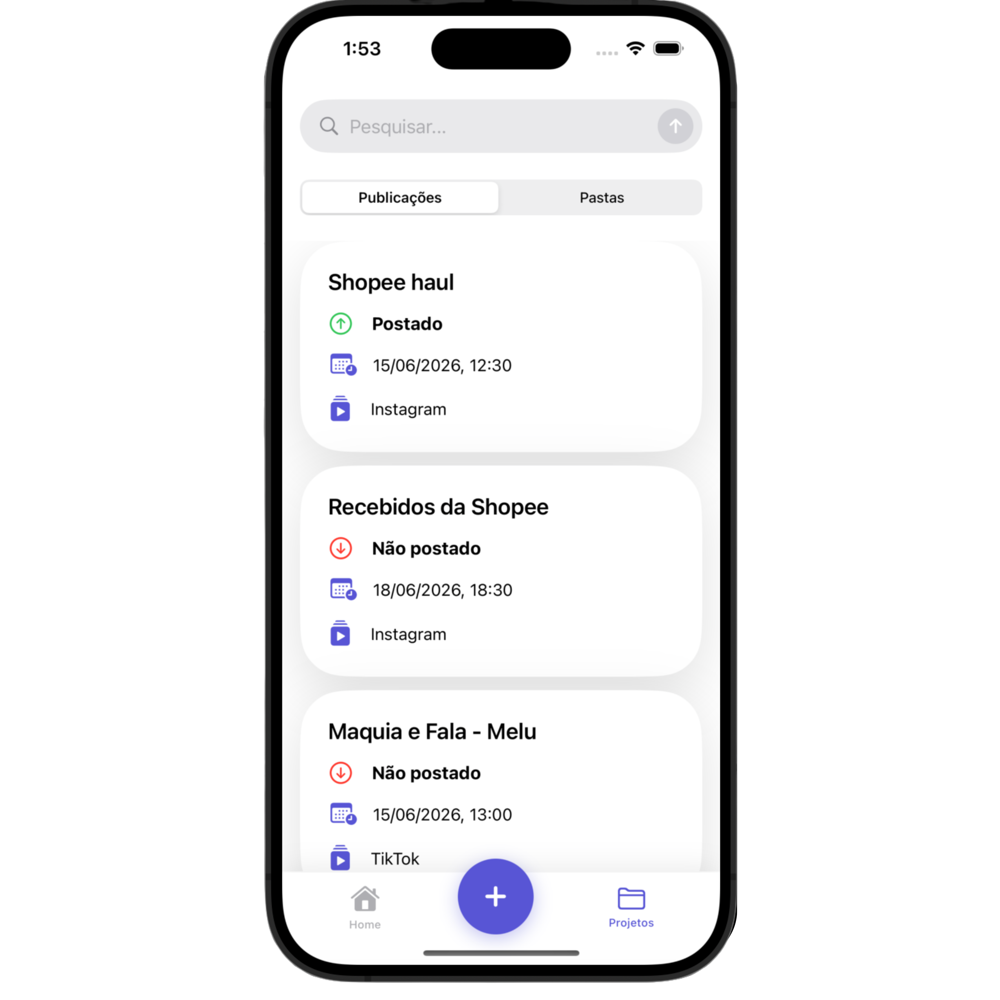
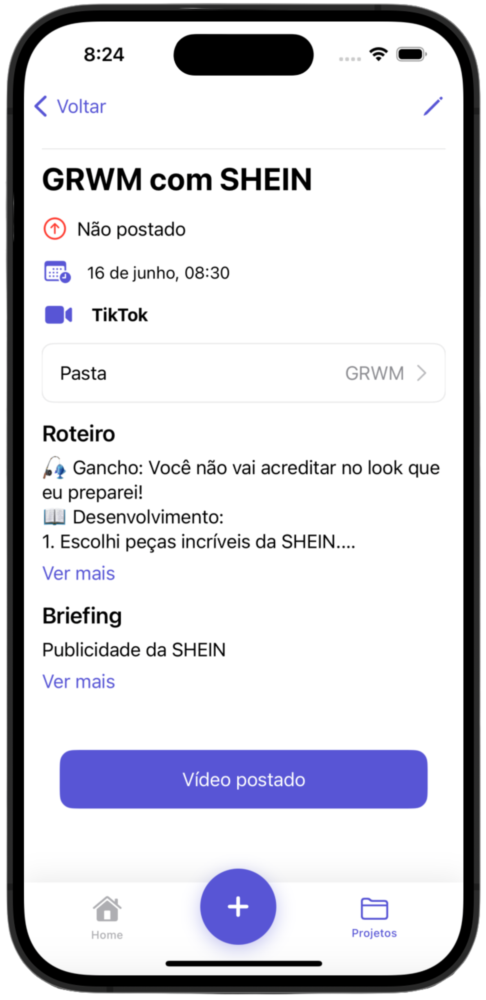
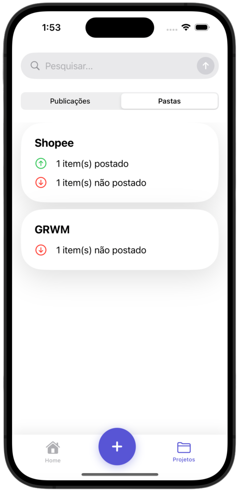
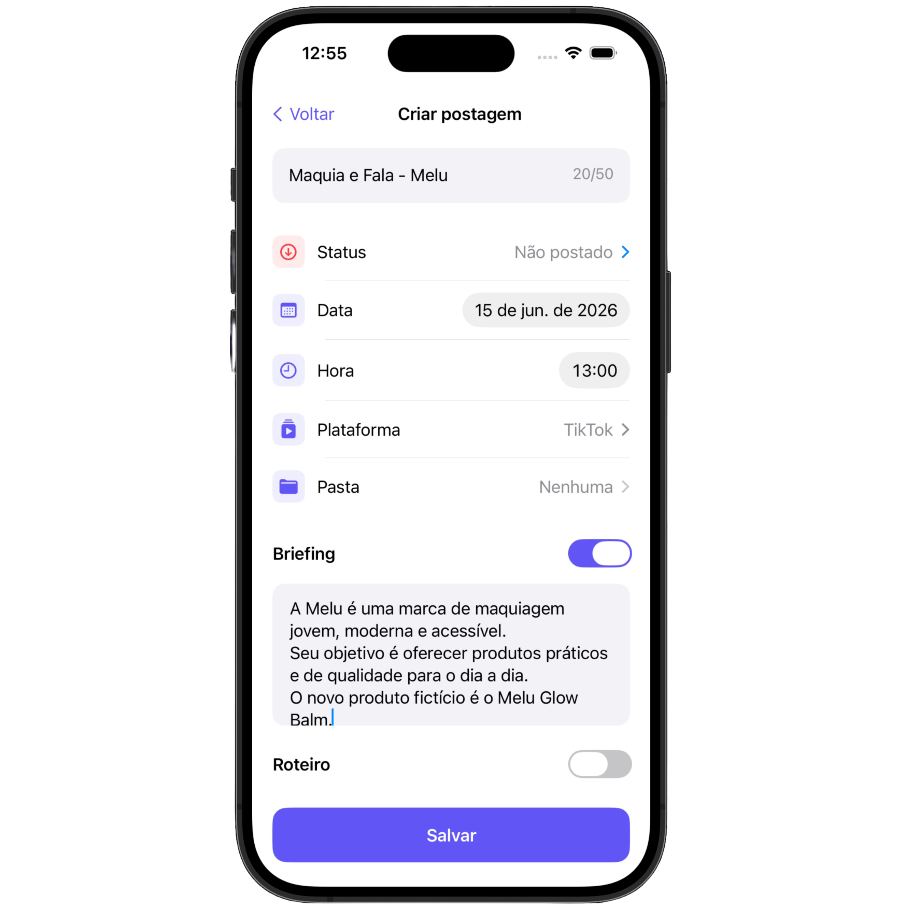

# 4Creators

Aplicativo iOS para **planejamento, organização e gerenciamento da rotina de criadores de conteúdo**, centralizando publicações, pastas, briefings, roteiros e cronogramas em um único fluxo.

  
  
  

> Este repositório apresenta o projeto, suas principais funcionalidades e decisões técnicas. O código-fonte completo não está disponível publicamente neste momento.

---

## Sobre o projeto

Criadores de conteúdo precisam lidar simultaneamente com ideias, campanhas, briefings, roteiros, diferentes plataformas e prazos de publicação.

O **4Creators** foi desenvolvido para centralizar esse fluxo de trabalho em uma única aplicação, auxiliando principalmente nano e microcriadores na organização dos conteúdos e no acompanhamento de suas publicações.

O aplicativo reúne ferramentas para planejar postagens, acompanhar datas e horários, organizar conteúdos em pastas, armazenar briefings e roteiros e receber alertas para publicações programadas.

Além da organização manual, o projeto utiliza **Inteligência Artificial como apoio ao planejamento e à criação de conteúdo**.

---

## Principais funcionalidades

### Planejamento de publicações

A tela inicial apresenta as próximas publicações organizadas por data, permitindo visualizar rapidamente conteúdos programados, horários, plataformas e status.

O aplicativo também envia alertas no horário definido para uma publicação, reduzindo a necessidade de utilizar lembretes externos.

  

### Organização de conteúdos

As publicações podem ser agrupadas em pastas de acordo com campanhas, temas ou necessidades do criador.

A área de projetos permite:

- visualizar publicações e pastas;
- pesquisar conteúdos pelo nome;
- acompanhar publicações concluídas e pendentes;
- visualizar os conteúdos relacionados a cada pasta;
- adicionar publicações existentes a uma pasta;
- criar novas pastas diretamente pelo aplicativo.

  
  &nbsp;&nbsp;
  

### Criação e gerenciamento de conteúdo

Ao criar uma nova publicação, o usuário pode registrar informações importantes para o planejamento do conteúdo, como:

- título;
- status;
- data e horário;
- plataforma;
- pasta;
- briefing;
- roteiro.

Essas informações permanecem centralizadas na aplicação e podem ser consultadas e editadas posteriormente.

  
  &nbsp;&nbsp;
  

---

## Inteligência Artificial

O **4Creators** possui integração com a **API da OpenAI** para auxiliar na criação e organização de conteúdos dentro do aplicativo.

A partir das informações fornecidas pelo usuário, a IA interpreta o contexto da solicitação e utiliza esses dados para executar ações dentro do fluxo da aplicação.

Entre suas possibilidades estão:

- criar novas publicações;
- criar pastas;
- organizar publicações dentro de projetos;
- identificar informações como data e plataforma;
- preencher automaticamente os campos correspondentes com base na entrada do usuário;
- gerar um briefing inicial;
- gerar um pequeno roteiro a partir do título e do contexto da publicação.

O objetivo da integração é reduzir tarefas manuais de organização e ajudar o criador a transformar uma ideia inicial em um conteúdo mais estruturado.

### Demonstração

A demonstração em vídeo apresenta o assistente de IA em funcionamento, utilizando uma entrada em linguagem natural para auxiliar na criação e organização de conteúdo dentro do aplicativo.

<!-- O vídeo da IA será inserido aqui. -->

---

## Tecnologias

| Tecnologia | Utilização |
|---|---|
| **Swift** | Desenvolvimento da aplicação |
| **SwiftUI** | Construção das interfaces |
| **UIKit** | Apoio na implementação de elementos e comportamentos de interface |
| **Core Data** | Persistência local dos dados |
| **OpenAI API** | Recursos de Inteligência Artificial |
| **Xcode** | Ambiente de desenvolvimento |

---

## Decisões técnicas e desafios

Um dos principais desafios do projeto foi o desenvolvimento colaborativo utilizando **diferentes versões do Xcode e diferentes gerações de equipamentos**.

Essa limitação influenciou algumas decisões técnicas. Embora recursos mais recentes do ecossistema Apple já estivessem disponíveis, nem todos eram compatíveis com os ambientes utilizados pela equipe.

Para manter o projeto executável e permitir que todos os integrantes conseguissem contribuir, algumas soluções precisaram ser adaptadas, incluindo:

- utilização do **Core Data** para persistência local, em vez do SwiftData;
- adoção de soluções de navegação compatíveis com versões anteriores;
- integração entre **SwiftUI e UIKit** em partes da interface;
- desenvolvimento de componentes personalizados para atender às necessidades da aplicação e às limitações dos ambientes utilizados.

Essa experiência trouxe aprendizados sobre como decisões técnicas precisam considerar **compatibilidade, estabilidade, ambiente de desenvolvimento e contexto da equipe**, e não apenas a adoção da tecnologia mais recente.

---

## Minha contribuição

Contribuí para o **desenvolvimento das telas com Swift e SwiftUI**, trabalhando em conjunto com outra desenvolvedora na implementação das interfaces da aplicação.

Durante o desenvolvimento, também participei das adaptações necessárias para manter as telas compatíveis com as diferentes versões do Xcode e ambientes utilizados pela equipe, realizando ajustes e criando **componentes de interface personalizados**.

---

## Equipe

O projeto foi desenvolvido por uma equipe composta por **três desenvolvedores e uma designer**.
